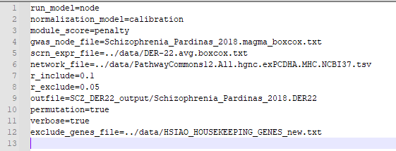
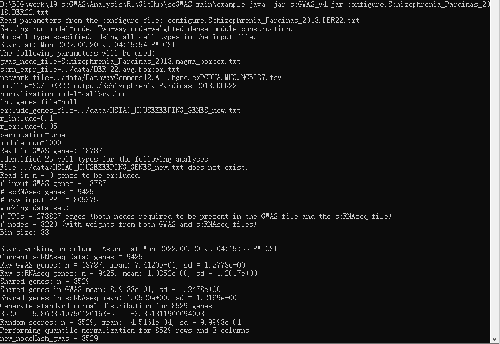

This folder contains a runnable example of the scGWAS analysis, using a GWAS dataset for schizophrenia and an adult brain panel.

### Step 1. Prepare the four input files
- Schizophrenia_Pardinas_2018.magma_boxcox.txt
- data/DER-22.avg.tsv
- data/PathwayCommons12.All.hgnc.exPCDHA.MHC.NCBI37.tsv
- data/HSIAO_HOUSEKEEPING_GENES_new.txt

### Step 2. Prepare the configure file
The configure file is here: configure.Schizophrenia_Pardinas_2018.DER22.txt. A screenshot looks like below:

### Step 3. Run scGWAS

`java -jar scGWAS_v4.jar configure.Schizophrenia_Pardinas_2018.DER22.txt`

A screen shot is as below:

After finishing the analysis, there will be three files generated in the output folder:
- Schizophrenia_Pardinas_2018.DER22..shared_genes.scores.calibration.txt
- Schizophrenia_Pardinas_2018.DER22.all.random_modules.txt
- Schizophrenia_Pardinas_2018.DER22.combined-z.txt

**Note that 'Schizophrenia_Pardinas_2018.DER22' is the output file name specified in the configure file: outfile=SCZ_DER22_output/Schizophrenia_Pardinas_2018.DER22**

### Step 4. Define significant modules
- run the code analysis/3.define_sig.R
- The significant modules and module genes will be generated
